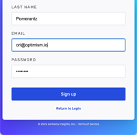
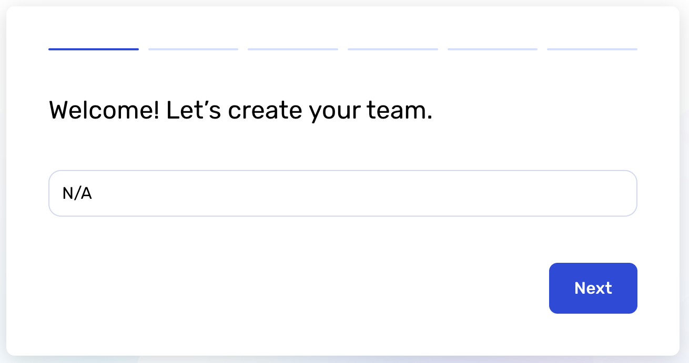
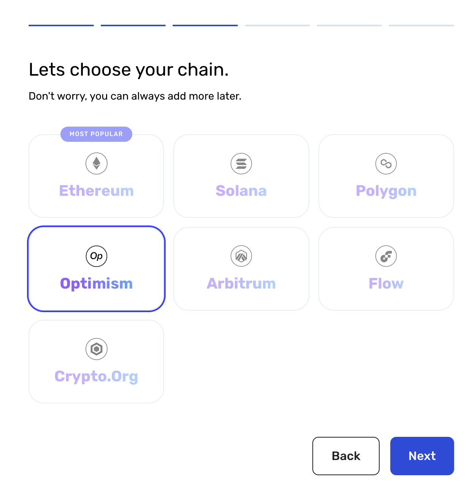
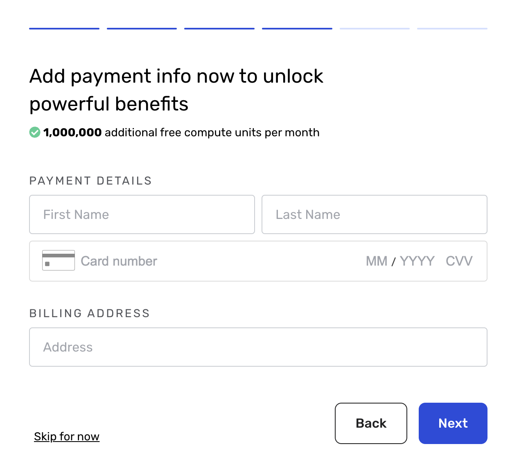

# Getting your API keys from Alchemy

[](https://discord-gateway.optimism.io)
[](https://twitter.com/optimismFND)

This tutorial assumes you are completely new to Alchemy, but that you want to get applications and API keys to use with Optimism.


## Register

The first step is to register for a free Alchemy account.

1. Browse [to Alchemy](https://auth.alchemyapi.io/signup?redirectUrl=https%3A%2F%2Fdashboard.alchemyapi.io%2Fsignup%2F%3Freferrer_origin%3DDIRECT), enter user information, and click **Sign up**.

   

1. Go to your e-mail and click **VERIFY EMAIL**.

1. Fill up the requested information (team, type of project, etc.).

   

1. When asked for chain select **Optimism** and click **Next**.   

   

1. Select the free plan and click **Next**.   

1. Either enter payment details or click **Skip for now**.

   


## Setup 


### Wallet

Before you can use Ethereum you need [wallet software](https://cointelegraph.com/news/overview-of-software-wallets-the-easy-way-to-store-crypto).
In this tutorial we use [MetaMask](https://metamask.io/), a browser extension, as our wallet.
You can also use MetaMask in a mobile device (iOS or Android), but for software development it is best to use a notebook or desktop computer.

1. Make sure you have either Chrome, Firefox, Brave, or Edge. 

1. Browse to [MetaMask](https://metamask.io/), scroll down and choose to install MetaMask for your browser.

1. Click **Get Started**.

1. Click **Create a wallet** and then **I agree**.

1. Type a password, accept the terms, and click **Create**.

1. Click **Next**, reveal the secret words, and write them down somewhere safe. 
   We plan to only use this wallet for testing, so the key phrase should not matter that much, but it's best to develop good habits from the beginning.

1. Let MetaMask help you confirm you have the correct written key phrase.

1. Copy your address, you'll need it soon.

### Blockchain

In this tutorial we'll use [Optimism](https://www.optimism.io/), an Ethereum Layer 2 blockchain, to run our contracts.

[Deploying contracts and interacting with them costs gas, which has to be purchased with Ether (also known as ETH)](https://ethereum.org/en/developers/docs/gas/). 
On the production network that Ether costs money, it is part of the security mechanism of Ethereum.
To avoid spending real money, we'll use Optimism Goerli, a test network built on top of Goerli.
The test network also requires ETH, but it is test ETH you can get for free.

1. Use [this faucet](https://optimismfaucet.xyz/) to obtain Optimism Goerli test ETH.
   Follow five [github](https://github.com/) users or organizations to get past the anti-Sybil defense.

1. [Go here](https://chainid.link/?network=optimism-goerli) to add Optimism Goerli to your wallet. 
   Click **Connect** on the web page and then **Approve** in MetaMask.

1. Permit the network switch.

1. See if you have anything on Optimism Goerli.


## Interacting with a Solidity contract

The most common smart contract development language is called [Solidity](https://docs.soliditylang.org/en/latest/).
Here we will use using an integrated development environment (IDE) called [Remix](https://remix.ethereum.org/).
It has the significant advantage of requiring minimal set up because it runs in your browser.


1. Go to [Remix](https://remix.ethereum.org).

1. Click the Files icon () and open **contracts > 1_Storage.sol**.

1. Click the Compiler icon () 

1. Expand **Advanced Configurations** and select the EVM version **berlin**.

1. Click **Compile 1_Storage.sol**.

1. Click the Run icon ().

1. Select the Environment **Injected Provider**.

1. In MetaMask, click **Next** and then **Connect** to accept the connection in the wallet.

1. To add the smart contract into the blockchain, click **Deploy** (in Remix) and **Confirm** the transaction in MetaMask.

1. Expand the contract **STORAGE AT ...** and scroll down to see what you can do.

1. To retrieve the current stored number, click **retrieve**. 
   Note that as this is a read-only operation, it does not cost anything and does not require MetaMask confirmation.

1. See the retrieved number right below the **retrieve** button.

   

1. To change the number, type a value next to **store** and then click it. Because this is a transaction that affects the blockchain state it costs ETH and requires you to **Confirm** on MetaMask.   

   

1. In the Remix console (bottom right quadrant of the window), expand the bottom entry to see the transasction information.

   

1. To verify that the transaction is now part of the permanent blockchain record:

   1. Copy the transaction hash from the remix console.

   1. Open [Blockscout for Optimism Goerli](https://blockscout.com/optimism/goerli).

   1. Search for the transaction hash. 
      Note that it may take a few minutes for Blockscout to get updated.

1. Back in Remix, click **retrieve** again to see that the value has changed.

   


### How does it work?

To understand the `Storage` contract, let's go over it line by line


```solidity
// SPDX-License-Identifier: GPL-3.0
```

The Solidity compiler expects every source file to have a license comment. [See the list of supported licenses](https://spdx.org/licenses/).

```solidity
pragma solidity >=0.7.0 <0.9.0;
```


This line specifies the acceptable versions of the Solidity programming language. 
In this case we only allow 0.7.x and 0.8.x versions. 
This is important because Solidity is new and still developing rapidly, and therefore [breaking changes](https://docs.soliditylang.org/en/v0.8.11/080-breaking-changes.html) are necessary from time to time.

```solidity

/**
 * @title Storage
 * @dev Store & retrieve value in a variable
 */
contract Storage {
```

Define a contract called **Storage**. 
A contract functions in many ways like [a class in Object Oriented Programming](https://en.wikipedia.org/wiki/Class_(computer_programming)). 
It contains variables and methods.

```solidity

    uint256 number;
```

This is a field variable. The type, **uint**, is a 256 bit unsigned integer. 
This is the standard type for [evm](https://ethereum.org/en/developers/docs/evm/) variables.

Note that all the fields in a contract are effectively public. 
Ethereum code is executed by multiple computers in multiple locations, and can be verified by anybody. 
This would be impossible if some part of the contract state had been unreadable. 
A field variable being `private` only means it cannot be ready by on-chain code.

```solidity

    /**
     * @dev Store value in variable
     * @param num value to store
     */
    function store(uint256 num) public {
```

This is a Solidity function definition (for a function without a return value). 
It includes:

- Function name (`store`)
- Parameters (in this case there is only one, `num`)
- A visibility modifier (in this case `public`, which makes the function callable from anywhere).

```solidity
        number = num;
    }
```

The rest of the function is standard for languages derived from C.


```solidity
    /**
     * @dev Return value 
     * @return value of 'number'
     */
    function retrieve() public view returns (uint256){
```        

This is another function definition, with a few differences:

- The function is defined as a `view`, which means it is a read-only function that doesn't change the state.
  As you have seen, calling this kind of function is free.

```solidity
        return number;
    }
}
```

To learn more Solidity we have [a list of resources](https://help.optimism.io/hc/en-us/articles/4412777835675-Developer-information#h_01FVSVQ5ZQFJDSRYY6WTY18F0N). 
If you learn best by reading source code, [try here](https://ethereum.org/en/developers/tutorials/erc20-annotated-code/).
